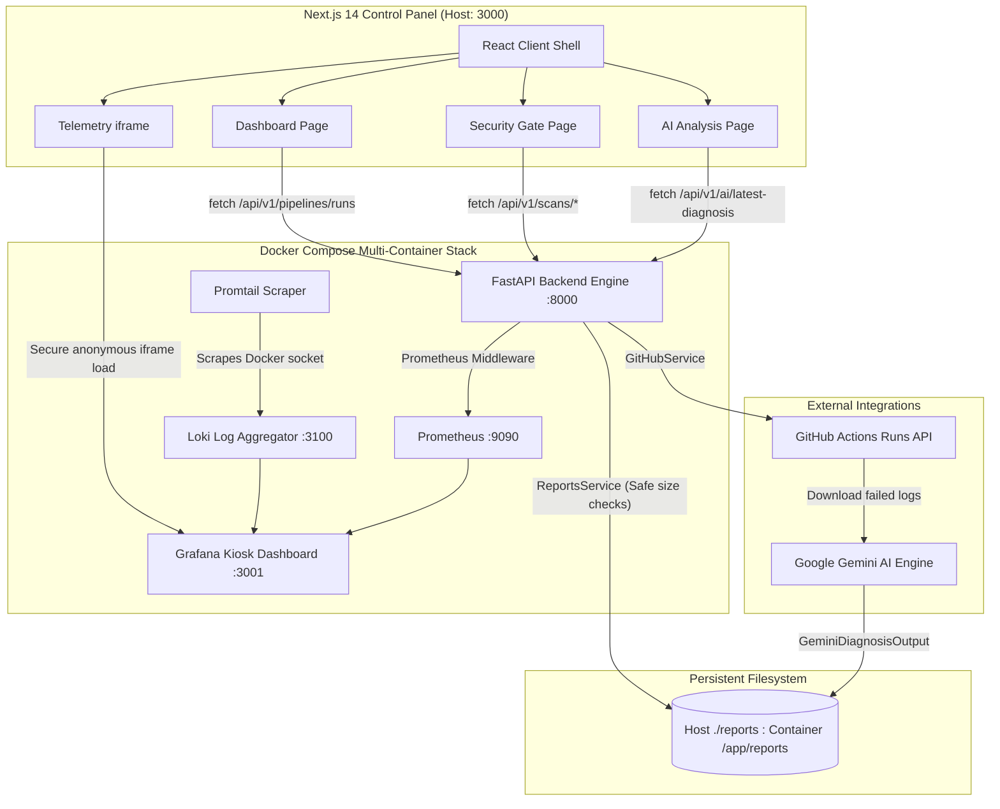

# 🤖 AutoHeal DevOps Agent

[](https://nextjs.org/)
[](https://fastapi.tiangolo.com/)
[](https://aistudio.google.com/)
[](https://github.com/aquasecurity/trivy)
[](https://github.com/PyCQA/bandit)
[](https://github.com/chainguard-images/images)
[](https://opensource.org/licenses/MIT)

**AutoHeal DevOps Agent** is a production-ready, full-stack, AI-native DevSecOps platform designed to automate and streamline the software delivery and self-healing lifecycle. 

It provides engineers with a highly polished, responsive **Next.js 14 Control Panel** integrated with a **FastAPI v1 backend**, orchestrating **Google Gemini AI** failure diagnosis, real-time GitHub Actions workflow state synchronization, zero-vulnerability container runtime environments, and embedded Grafana telemetry.

---

## 🏗️ Technical Architecture

The platform is architected with a "Security-First" and "Observability-Always" mindset, linking five core dimensions into a cohesive runtime environment:



---

## 🚀 Key Features

*   **🧠 Dynamic AI Analysis & GitHub Synchronization**: Automatically parses failed CI/CD workflow logs via Gemini. If the latest build succeeds, the API automatically clears historical stale data, transitioning the Control Panel into a beautiful, green **"System Fully Healthy"** operational screen.
*   **🛡️ Multi-Stage DevSecOps Pipeline**: Integrated static application security testing (**Bandit SAST**), software composition analysis (**pip-audit SCA**), and container scanning (**Trivy FS/Image**) that block pipeline progression on any High/Critical CVE.
*   **📦 Hardened Zero-CVE Base**: Multi-stage Docker builds compiled over shell-less **Chainguard Distroless Python** base runtimes, eliminating 100% of standard OS shell-injection vectors.
*   **📊 Embedded Iframe Telemetry**: Embedded, dark-themed Grafana kiosk dashboards running anonymously on host port `3001` to view live request rates, error rates (5xx %), P95 latencies, and Promtail log streams in real-time.
*   **🔍 Correlation Traceability**: Full request lifecycle correlation utilizing custom `X-Request-ID` middleware, letting you trace singular client calls across metrics, logs, and trace aggregates instantly.

---

## 🛠️ Tech Stack

| Category | Technology |
|---|---|
| **Frontend** | React 18, Next.js 14 (App Router), Tailwind CSS, Lucide icons, shadcn/ui |
| **Backend** | Python 3.12, FastAPI, Uvicorn, PyGithub, Pydantic v2 (BaseSettings) |
| **AI Core** | Google Gemini API (gemini-2.5-flash / gemini-2.5-pro) |
| **Observability** | Prometheus, Loki, Promtail, Grafana (Kiosk Mode provisioned) |
| **Security Gates** | Trivy (FS & Image), Bandit (SAST), pip-audit (SCA) |
| **Infrastructure** | Docker, Docker Compose, Multi-stage Chainguard Distroless containers |

---

## 🚦 Quick Start Guide

### Prerequisites
- Docker & Docker Compose
- Node.js 18+ (for local frontend dev)
- Google Gemini API Key ([Get one here](https://aistudio.google.com/app/apikey))
- GitHub Personal Access Token (for workflow runs integration)

### Step 1: Environment Configuration
Create a `.env` file in the project root:
```env
GEMINI_API_KEY=your_gemini_api_key_here
ENVIRONMENT=production
LOG_LEVEL=INFO

# GitHub Credentials (used to fetch live workflows)
GITHUB_TOKEN=your_github_token_here
GITHUB_REPOSITORY=your_username/your_repository_name

GRAFANA_ADMIN_PASSWORD=autoheal
```

Create a `frontend/.env.local` file inside the `frontend/` directory:
```env
NEXT_PUBLIC_API_URL=http://localhost:8000
NEXT_PUBLIC_GRAFANA_URL=http://localhost:3001
NEXT_PUBLIC_LOKI_URL=http://localhost:3100
```

### Step 2: Build and Run the Stack
Start the core services (API, Prometheus, Loki, Promtail, Grafana):
```bash
docker compose up -d --build
```

### Step 3: Run the Next.js Frontend
In a separate terminal, start the Next.js dev server:
```bash
cd frontend
npm install
npm run dev
```

### Step 4: Verify End-to-End Health
- **Next.js Control Panel**: [http://localhost:3000](http://localhost:3000)
- **FastAPI Backend Core**: [http://localhost:8000/health/](http://localhost:8000/health/)
- **Prometheus Metrics**: [http://localhost:8000/metrics](http://localhost:8000/metrics)
- **Grafana Server**: [http://localhost:3001](http://localhost:3001) (Loaded natively as a kiosk inside the control panel)

---

## 📊 Live Observability Specifications

The platform includes a pre-configured, auto-provisioned **AutoHeal Overview** dashboard in Grafana (accessible directly in the Next.js Monitoring view):

- **Request Throughput**: Continuous gauge tracking current req/s rate.
- **P95 / P99 Latency**: Microsecond-resolution histograms measuring API response overhead.
- **Error Rates**: Active trackers graphing 4xx and 5xx response ratios.
- **Application Log Stream**: Native Loki-Scraped log output, filterable and searchable in real-time.

---

## 🛡️ Container Hardening & Security

AutoHeal implements elite-tier container practices:
- **No Shell (`/bin/sh` or `/bin/bash` removed)**: Prevents attackers from initiating interactive sessions in the container.
- **No Package Manager (`apk` / `apt` / `pip` removed)**: Bypasses container remote package execution.
- **Non-Root Runtime**: Containers execute natively as UID `65532` (`nonroot`), protecting host namespaces from potential escape vulnerabilities.

---

## 📖 Deep-Dive Documentation

Explore our exhaustive engineering guides:
- [📖 Technical Architecture](docs/architecture.md) — Under-the-hood components and synchronization loops.
- [🚀 Deployment Guide](docs/deployment-guide.md) — Standardized deployment setups.
- [🔍 API Guide](docs/api-guide.md) — Versioned route schemas and standard envelopes.
- [🛠️ Troubleshooting Guide](docs/troubleshooting.md) — Real-world issue catalog and resolution steps.
- [💬 Technical Interview Prep](docs/interview-qa.md) — High-level Q&A covering the final system.
- [📄 Resume & LinkedIn Descriptions](docs/resume-project-description.md) — ATS-optimized impact statements.

---

## 📄 License
This project is licensed under the MIT License. See `LICENSE` for details.
