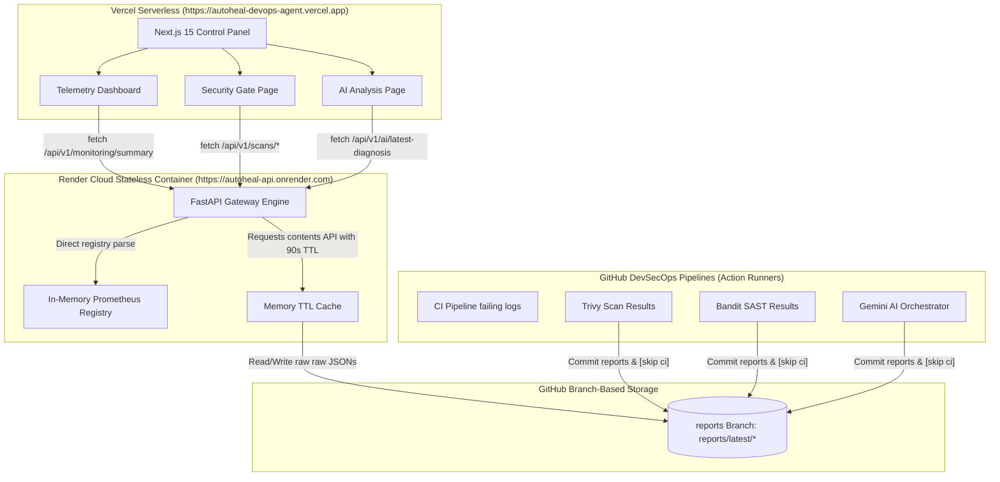
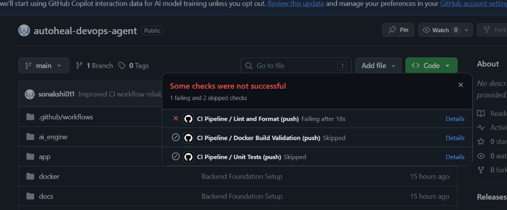
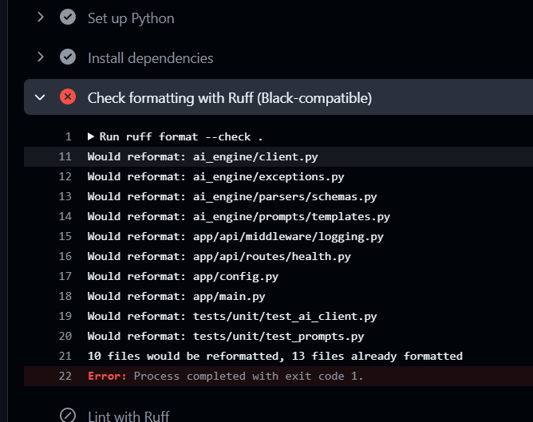
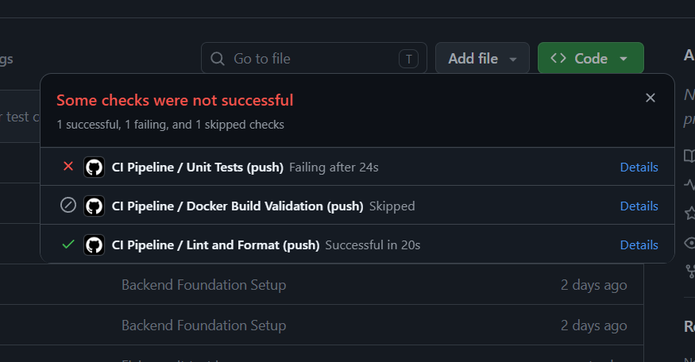
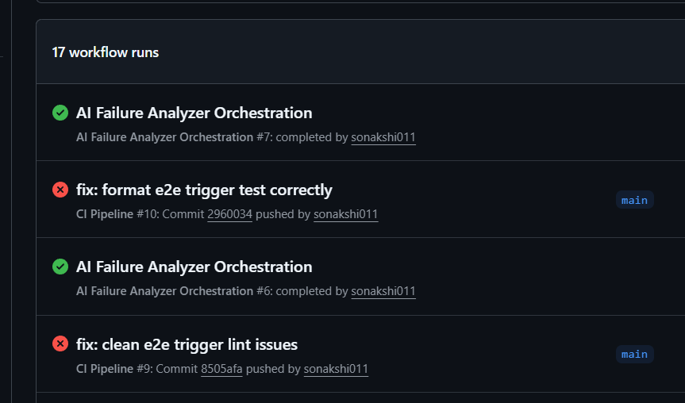
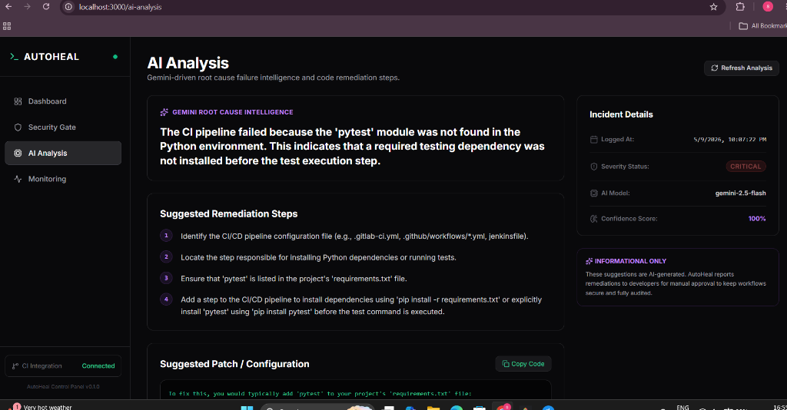
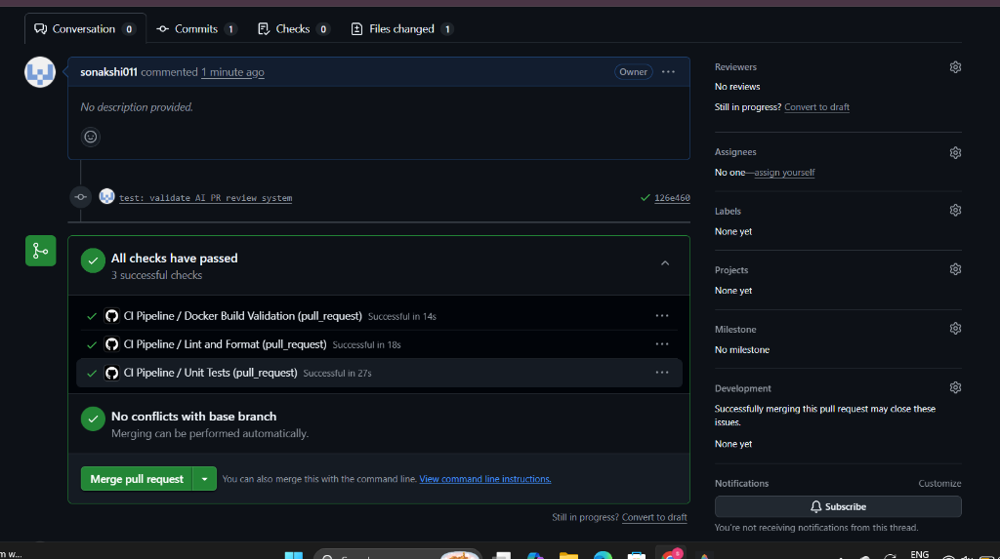
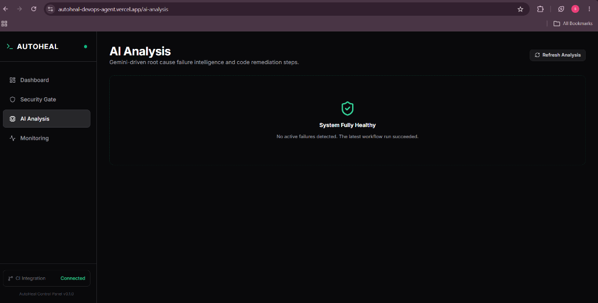
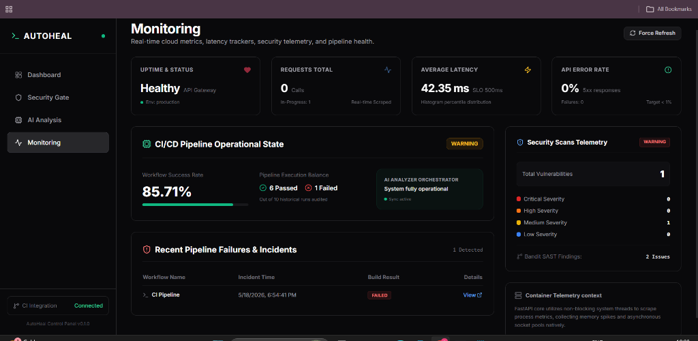
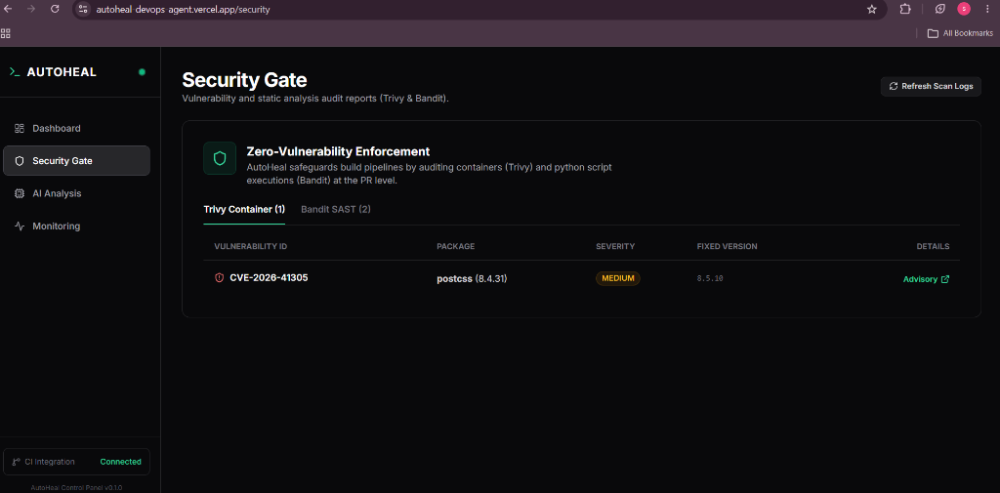

# 🤖 AutoHeal DevOps Agent

[](https://autoheal-devops-agent.vercel.app)
[](https://autoheal-api.onrender.com/docs)
[](https://aistudio.google.com/)
[](https://github.com/aquasecurity/trivy)
[](https://github.com/PyCQA/bandit)
[](https://github.com/chainguard-images/images)
[](https://opensource.org/licenses/MIT)

**AutoHeal DevOps Agent** is a production-operational, recruiter-grade AI-native DevSecOps automation platform that orchestrates real-time static code audits, container security composition analysis, and event-driven pipeline self-healing.

The platform couples a responsive **Next.js 15 Control Panel** with a stateless **FastAPI v1 API Gateway**, leveraging **Google Gemini AI** failure diagnostics, serverless Prometheus telemetry dashboards, and a specialized **GitHub `reports` branch synchronization loop** for seamless cloud persistence.

---

### 🌐 Live Production Links
*   **Production Control Panel**: [https://autoheal-devops-agent.vercel.app](https://autoheal-devops-agent.vercel.app)
*   **Production API Gateway**: [https://autoheal-api.onrender.com](https://autoheal-api.onrender.com)
*   **API Swagger Documentation**: [https://autoheal-api.onrender.com/docs](https://autoheal-api.onrender.com/docs)

---

## 🏗️ Technical Architecture & Telemetry Loop

The platform is designed with a **stateless, zero-disk dependency model** to run efficiently on standard free-tier limits, decoupling telemetry and reporting into separate event-driven domains:



---

## 💡 "Why This Architecture?" — Systems Engineering Thinking

Every architectural choice in the AutoHeal platform was driven by strict cloud-native constraints, optimizing for statelessness, resource efficiency, and zero operational overhead:

### 1. Why the `reports` Git Branch was chosen for storage?
*   *The Problem*: Render and Vercel container filesystems are strictly ephemeral; any reports written to a local folder disappear on the next scale-out or container restart. 
*   *The Engineering Solution*: Instead of introducing a complex database cluster or expensive AWS S3 storage buckets, the platform utilizes a dedicated, stateless git branch (`reports`) as an **immutable, version-controlled audit ledger**. GitHub Actions commits reports directly to `reports/latest/*` and `reports/history/YYYY-MM-DD/*`. The FastAPI backend dynamically fetches these JSONs via raw API payloads. This ensures **100% data persistence, native auditing, and complete zero-cost maintenance**.

### 2. Why Serverless Telemetry & No Heavy Grafana Stack?
*   *The Problem*: Running a traditional multi-container sidecar stack (Prometheus database + Loki logging + Promtail collector + Grafana kiosk container) consumes over 1.5GB of RAM, easily causing Out-Of-Memory (OOM) crashes on 512MB RAM free-tier limits.
*   *The Engineering Solution*: We bypassed database operations completely by writing an **In-Memory Prometheus Registry Middleware Parser** inside FastAPI. When the frontend requests `/api/v1/monitoring/summary`, the backend reads the active process metrics, HTTP request counters, and durations directly from RAM in milliseconds. This provides **real-time metrics, sub-second latency, and zero persistent database overhead**.
*   *No Grafana*: We compiled custom, responsive telemetry widgets natively into Next.js 15 using Lucide icons and progress rings. This eliminates complex X-Frame-Options anonymous iframe hacks and creates a premium, unified developer UX that loads instantly.

### 3. Why the Vercel + Render Split Deployment?
*   *Frontend (Vercel)*: Deployed as serverless edge functions to guarantee ultra-fast globally distributed client delivery, automatic static site optimizations, and seamless continuous integrations.
*   *Backend (Render)*: Deployed as a persistent web service, allowing the multi-threaded FastAPI engine to run uninterrupted, maintain in-memory TTL caching, and expose clean ASGI swagger endpoints.

### 4. Why GitHub Actions Orchestration?
*   *Decoupled Compute*: Heavy security static auditing (Bandit SAST, Trivy FS container scans) and LLM generative runs are executed entirely inside ephemeral GitHub-hosted runners. This keeps the core API extremely lightweight, ensuring that long-running security evaluations never block client requests or degrade API response SLA thresholds.

---

## 📸 Chronological Self-Healing Lifecycle

This chronology demonstrates the end-to-end event-driven self-healing pipeline of the AutoHeal platform:

### Step 1: CI Pipeline Incident Detection
When a developer pushes broken formatting or code changes that break unit tests, the GitHub Actions CI pipeline instantly isolates the incident.

*Figure 1: GitHub Actions CI pipeline captures a formatting check failure.*

### Step 2: Static Analysis Audit Isolation
The pipeline fails during Ruff compilation checks, preventing broken code from progressing to subsequent staging or build phases.

*Figure 2: Ruff formatting logs capturing the precise code files requiring remediation.*

### Step 3: Event-Driven Unit Test Failures
Similarly, any unit test crash triggers the analyzer, ensuring no broken logic makes it to production.

*Figure 3: CI Pipeline unit test checks failing popup.*

### Step 4: AI Failure Analyzer Orchestration
Upon capturing a build crash, the event-driven orchestrator triggers our Google Gemini AI failure analysis script, generating a rich root cause diagnosis.

*Figure 4: Automated, isolated execution of the Gemini AI failure diagnostic runner.*

### Step 5: High-Fidelity AI Root Cause Diagnosis
Developers open the **AI Analysis** panel on their Next.js Control Panel to find the precise failure explanation, suggested remediations, and copyable safe-patch configurations!

*Figure 5: Next.js 15 control panel rendering Gemini-driven root cause failure intelligence.*

### Step 6: Fully Resolved / Healed PR State
Once the developer applies the suggested patch, all pipeline gates successfully compile to a 100% green passing state!

*Figure 6: Pull Request healed, passing all DevSecOps static and unit test gates.*

### Step 7: Real-Time Dynamic Healing Verification
The FastAPI gateway automatically captures the successful workflow status, suppresses any historical failure reports from the active branch cache, and directs the Next.js control panel to render a clean, green operational banner:

*Figure 7: The AI Analysis screen transitions dynamically into a green system-healthy state.*

---

## 📊 Live Cloud-Native Monitoring & Telemetry

Our custom-built **Cloud-Native Telemetry Dashboard** fetches live Prometheus metrics, pipeline incident tracking registers, and Trivy security severity balances directly in-memory from Render APIs:


*Figure 7: High-fidelity cloud-native operational telemetry dashboard.*

### 🔍 Operational Telemetry Breakdown:
1.  **API Gateway Status**: Exposes live heartbeats, API error rates, and average endpoint durations using the in-memory Prometheus scraping parser.
2.  **CI/CD Pipeline Operational State**: Displays actual workflow success rate percentages (e.g., `85.71%`) and dynamic warning/healthy badges.
3.  **Active Incident Tracking**: Lists the exact failed workflows, execution timestamps, and direct external links to GitHub Action execution logs.
4.  **Security Scans Telemetry**: Visualizes Trivy vulnerabilities and Bandit SAST findings, breaking them down into Critical, High, Medium, and Low severity balances.

### 🛡️ Security Gate & Zero-Vulnerability Enforcement
Our Next.js 15 Control Panel features a dedicated **Security Gate** displaying active Trivy container CVE findings and Bandit SAST issues parsed directly from raw payloads committed to our stateless reports ledger:

*Figure 9: Next.js 15 Control Panel Security Gate rendering a PostgreSQL/postcss medium-severity vulnerability.*

---

## 🛠️ Technology Stack & Hardening

| Component | Stack Specification |
|---|---|
| **Frontend Platform** | React 18, Next.js 15 (App Router), TypeScript, Tailwind CSS, Lucide icons |
| **Backend Core** | Python 3.12, FastAPI ASGI, Uvicorn, Pydantic v2 (BaseSettings), PyGithub |
| **AI Orchestration** | Google Gemini API (gemini-2.5-flash / gemini-2.5-pro) |
| **Telemetry & Metrics**| Prometheus Registry scrapers (ASGI), in-memory TTL caching |
| **DevSecOps Gates** | Trivy (FS & Image), Bandit (SAST), pip-audit (SCA) |
| **Security Hardening** | Multi-stage Docker files, Chainguard Shell-less Distroless Python bases |

### 🔒 Base Container Security Hardening
The backend container runs on a hardened, shell-less **Chainguard Distroless Python** base:
*   **Zero OS Shells**: Bypasses Command Injections by removing `/bin/sh` and `/bin/bash`.
*   **No Package Managers**: `apk`, `apt`, and `pip` are completely stripped from the production image.
*   **Non-Root Namespace**: Runs strictly as UID `65532` (`nonroot`), protecting host kernels from possible namespace escapes.

---

## 🚀 Quick Start Guide

### Prerequisites
*   Node.js 18+ (for local frontend dashboard)
*   Python 3.12+ (for backend)
*   Google Gemini API Key ([Get one here](https://aistudio.google.com/app/apikey))
*   GitHub Personal Access Token (with `repo` permissions to fetch workflows)

### Step 1: Environment Configuration
Create a `.env` file in the project root:
```env
GEMINI_API_KEY=your_gemini_api_key_here
ENVIRONMENT=production
LOG_LEVEL=INFO

# GitHub Credentials (used to fetch live workflows)
GITHUB_TOKEN=your_github_token_here
GITHUB_REPOSITORY=your_username/your_repository_name
```

Create a `frontend/.env.local` file inside the `frontend/` directory:
```env
# Point to your local backend or production Render API URL
NEXT_PUBLIC_API_URL=http://localhost:8000
```

### Step 2: Backend Setup
1.  **Create Virtual Environment & Install Dependencies**:
    ```bash
    python -m venv .venv
    .venv\Scripts\activate  # On macOS/Linux: source .venv/bin/activate
    pip install -r requirements.txt
    ```
2.  **Run FastAPI Backend Dev Server**:
    ```bash
    python -m uvicorn app.main:app --reload --port 8000
    ```
    *Open the interactive API Swagger Documentation at [http://localhost:8000/docs](http://localhost:8000/docs).*

### Step 3: Frontend Dashboard Setup
1.  **Install Node Modules**:
    ```bash
    cd frontend
    npm install
    ```
2.  **Run Next.js Dev Server**:
    ```bash
    npm run dev
    ```
    *Open the Control Panel at [http://localhost:3000](http://localhost:3000).*

---

## 📖 Complete Engineering Documentation Guides
*   [📖 Technical Architecture Deep-Dive](docs/architecture.md) — Under-the-hood synchronization loops, cache TTLs, and statelessness.
*   [🚀 Deployment & Setup Guide](docs/deployment-guide.md) — Multi-environment setups, Render environments, and branch configurations.
*   [🔍 API Endpoint Specifications](docs/api-guide.md) — Swagger endpoints, requests schemas, and standardized envelopes.
*   [🛠️ Technical Troubleshooting Guide](docs/troubleshooting.md) — Diagnostic strategies and permissions fixes.
*   [💬 Recruiters Technical Interview Q&As](docs/interview-qa.md) — System design Q&As covering the final architecture.
*   [📄 ATS-Optimized Resume Descriptions](docs/resume-project-description.md) — High-impact resume bullet points.

---

## 📄 License
This project is licensed under the MIT License. See `LICENSE` for details.
