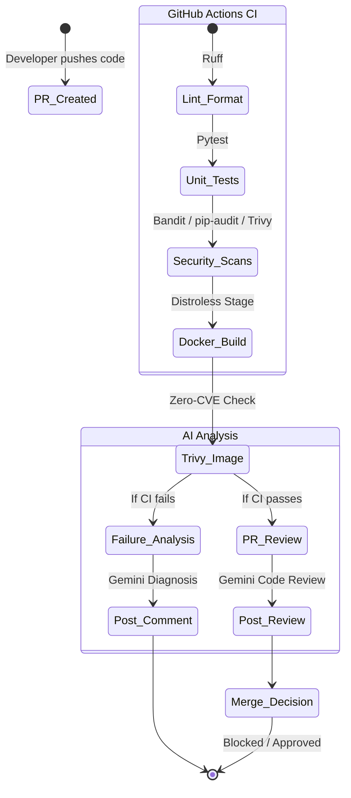

# CI/CD Lifecycle

```mermaid
stateDiagram-v2
    [*] --> PR_Created: Developer pushes code
    
    state "GitHub Actions CI" as CI {
        [*] --> Lint_Format: Ruff
        Lint_Format --> Unit_Tests: Pytest
        Unit_Tests --> Security_Scans: Bandit / pip-audit / Trivy
        Security_Scans --> Docker_Build: Distroless Stage
        Docker_Build --> Trivy_Image: Zero-CVE Check
    }
    
    state "AI Analysis" as AI {
        Trivy_Image --> Failure_Analysis: If CI fails
        Trivy_Image --> PR_Review: If CI passes
        Failure_Analysis --> Post_Comment: Gemini Diagnosis
        PR_Review --> Post_Review: Gemini Code Review
    }
    
    Post_Comment --> [*]
    Post_Review --> Merge_Decision
    Merge_Decision --> [*]: Blocked / Approved
```
