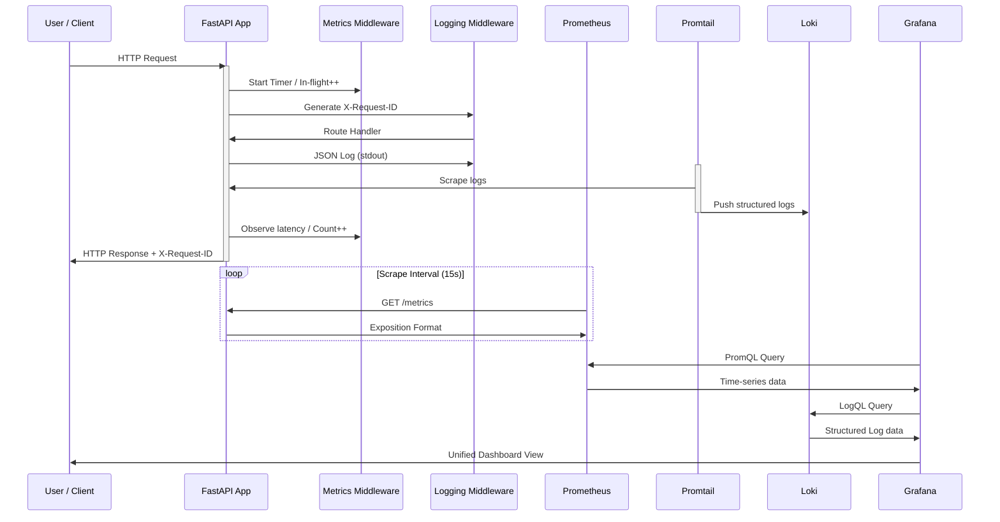

# Observability Data Flow

```mermaid
sequenceDiagram
    participant U as User / Client
    participant A as FastAPI App
    participant M as Metrics Middleware
    participant L as Logging Middleware
    participant P as Prometheus
    participant T as Promtail
    participant LK as Loki
    participant G as Grafana

    U->>A: HTTP Request
    activate A
    A->>M: Start Timer / In-flight++
    A->>L: Generate X-Request-ID
    L->>A: Route Handler
    A->>L: JSON Log (stdout)
    activate T
    T->>A: Scrape logs
    T->>LK: Push structured logs
    deactivate T
    A->>M: Observe latency / Count++
    A->>U: HTTP Response + X-Request-ID
    deactivate A

    loop Scrape Interval (15s)
        P->>A: GET /metrics
        A->>P: Exposition Format
    end

    G->>P: PromQL Query
    P->>G: Time-series data
    G->>LK: LogQL Query
    LK->>G: Structured Log data
    G->>U: Unified Dashboard View
```
