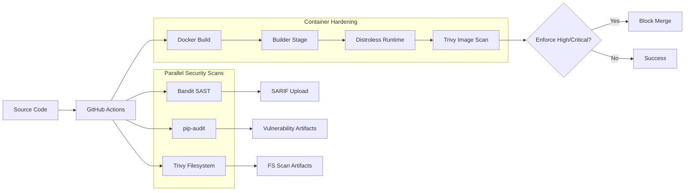

# Security Pipeline Flow

```mermaid
graph LR
    CODE[Source Code] --> CI[GitHub Actions]
    
    subgraph "Parallel Security Scans"
        BANDIT[Bandit SAST]
        AUDIT[pip-audit]
        TRIVY_FS[Trivy Filesystem]
    end
    
    CI --> BANDIT
    CI --> AUDIT
    CI --> TRIVY_FS
    
    subgraph "Container Hardening"
        BUILD[Docker Build]
        STAGE1[Builder Stage]
        STAGE2[Distroless Runtime]
        TRIVY_IMG[Trivy Image Scan]
    end
    
    CI --> BUILD
    BUILD --> STAGE1
    STAGE1 --> STAGE2
    STAGE2 --> TRIVY_IMG
    
    BANDIT --> SARIF[SARIF Upload]
    AUDIT --> ART1[Vulnerability Artifacts]
    TRIVY_FS --> ART2[FS Scan Artifacts]
    TRIVY_IMG --> ENFORCE{Enforce High/Critical?}
    
    ENFORCE -- Yes --> FAIL[Block Merge]
    ENFORCE -- No --> PASS[Success]
```
