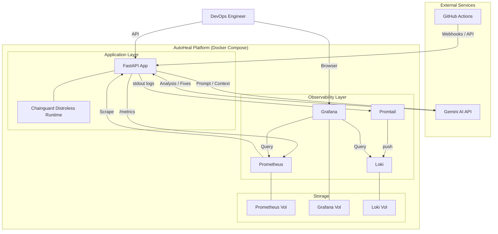

# System Architecture

```mermaid
graph TB
    subgraph "External Services"
        GA[GitHub Actions]
        GEMINI[Gemini AI API]
    end

    subgraph "AutoHeal Platform (Docker Compose)"
        subgraph "Application Layer"
            APP[FastAPI App]
            DIST[Chainguard Distroless Runtime]
            APP --- DIST
        end

        subgraph "Observability Layer"
            PROM[Prometheus]
            LOKI[Loki]
            GRAF[Grafana]
            PTAIL[Promtail]
        end

        subgraph "Storage"
            PVOL[Prometheus Vol]
            GVOL[Grafana Vol]
            LVOL[Loki Vol]
        end
    end

    GA -- Webhooks / API --> APP
    APP -- Prompt / Context --> GEMINI
    GEMINI -- Analysis / Fixes --> APP
    
    APP -- /metrics --> PROM
    APP -- stdout logs --> PTAIL
    PTAIL -- push --> LOKI
    
    PROM -- Scrape --> APP
    PROM --- PVOL
    LOKI --- LVOL
    
    GRAF -- Query --> PROM
    GRAF -- Query --> LOKI
    GRAF --- GVOL
    
    USER[DevOps Engineer] -- Browser --> GRAF
    USER -- API --> APP
```
