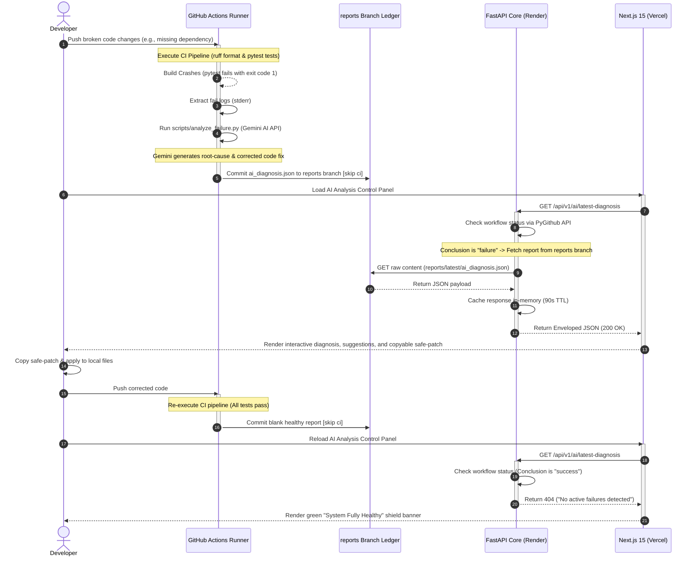

# AutoHeal DevOps Agent — Master Technical Handbook

Welcome to the **Master Technical Handbook** for the **AutoHeal DevOps Agent** platform. This document serves as a comprehensive system design deep-dive, learning companion, and interview preparation resource. It teaches you everything about the project—from the initial architectural struggles to the final, battle-tested cloud-native production deployment on Vercel and Render.

---

# 1. Project Introduction

### What is the AutoHeal DevOps Agent?
The AutoHeal DevOps Agent is a production-ready, full-stack, AI-native DevSecOps platform that automates continuous integration (CI) incident analysis, security composition audits, and pipeline self-healing. It links a highly polished **Next.js 15 developer Control Panel** with a **FastAPI v1 API Gateway**, orchestrating **Google Gemini AI** failure diagnostics, real-time GitHub Actions status synchronization, and serverless telemetry dashboards.

### Why was it created? (The MTTR Pain Point)
In modern software engineering, CI/CD pipelines are the gatekeepers of quality. However, they are also a major source of developer friction:
*   **The MTTR Problem**: When a build fails, developers must navigate to GitHub Actions, locate the correct job, scroll through thousands of lines of raw logs, diagnose compilation/format/unit test crashes, search StackOverflow, write a fix, and push again. This results in high **Mean Time to Resolution (MTTR)** and stalls developer velocity.
*   **The DevSecOps Barrier**: Security audits (SAST, SCA, container scanning) are often treated as detached gating tasks. Reviewing complex vulnerability reports (SARIF/JSON) requires specialized security understanding, delaying feature releases.

### Why AI in DevOps (AIOps)?
Generative Large Language Models (LLMs) like Google Gemini are incredibly skilled at textual pattern recognition, code comprehension, and translation. The AutoHeal DevOps Agent turns this capability into a structured, automated tool. Instead of forcing developers to read raw stack traces, the platform intercepts logs on build failures, sends them to Gemini AI with structured prompts, and immediately generates a clear diagnosis and copyable safe-patch recommendations.

### Why Self-Healing CI/CD Matters
A "Self-Healing" pipeline closes the loop between **Incident Detection** and **Incident Remediation**. By automatically generating suggested fixes directly within the developers' workspace, the platform shrinks debugging times from hours to seconds—democratizing elite DevSecOps operations for any developer or organization.

---

# 2. High-Level System Overview

The AutoHeal platform consists of six core architectural pillars:

```
  +-------------------------------------------------------------+
  |              Vercel Serverless Next.js 15 Client            |
  |  - Dashboard  - Security Gate  - AI Analysis  - Telemetry   |
  +------------------------------+------------------------------+
                                 | (Standard REST / HTTPS)
                                 v
  +-------------------------------------------------------------+
  |             Render Stateless FastAPI v1 Gateway             |
  |  - In-Memory Prom Registry   - Thread-Safe Memory Cache     |
  +------------------+-----------------------+------------------+
                     |                       |
                     v                       v
             [ReportsService]         [GitHubService]
                     |                       |
                     v (Raw GitHub contents) v (PyGithub API)
             +--------+---------+     +------+-------+
             |  Dedicated Git   |     |  GitHub      |
             | 'reports' branch |     |  Actions     |
             | (Stateless Ledger|     |  REST API    |
             +------------------+     +--------------+
```

### 1. The Next.js 15 Control Panel
Deployed on **Vercel**, the frontend provides a dark-mode, responsive portal. It replaces traditional Grafana embeds with native Tailwind widgets to deliver sub-second rendering. It includes connection health heartbeats, copyable patch widgets, and CVE advisories.

### 2. The FastAPI API Gateway
Deployed as a stateless Web Service on **Render**, the FastAPI backend manages ASGI HTTP traffic, coordinates external third-party requests, and routes versioned schemas (`/api/v1/*`). It operates completely database-free, leveraging in-memory collectors and caching to remain highly responsive on free-tier resource limits.

### 3. GitHub Actions CI/CD Pipelines
Heavy computation (Bandit SAST security scans, Trivy container composition scans, and Gemini log diagnostics) is offloaded entirely to ephemeral GitHub Action runners. This keeps the core API extremely lightweight.

### 4. Google Gemini AI Engine
When a build fails, the pipeline forwards log payloads to the `gemini-2.5-flash` model. It returns structured root-cause explanations and remediations.

### 5. The Stateless `reports` Branch Storage
To solve storage persistence without database clusters or expensive AWS S3 buckets, we use a dedicated git branch (`reports`) as an **immutable, version-controlled audit ledger**. Ephemeral scan artifacts are committed directly to this branch by GitHub Actions and dynamically read via raw REST payloads by the backend.

### 6. Serverless Telemetry
Exposed via Starlette/Prometheus middlewares, metrics are parsed directly from RAM on-demand, giving the user live average latencies and throughput stats with zero database footprints.

---

# 3. Complete Architecture Flow

The end-to-end lifecycle of an AutoHeal self-healing cycle operates in a structured event loop:



---

# 4. Frontend Deep-Dive (Next.js 15)

The Control Panel is compiled under strict Next.js 15 rules using the modular App Router.

### App Router Topography
*   **`/dashboard`**: Consumes `/api/v1/pipelines/runs` to display the chronological build run list, execution status, and external run details.
*   **`/security`**: Renders dynamic vulnerability metrics. It consumes `/api/v1/scans/trivy` and `/api/v1/scans/bandit`, mapping JSON/SARIF documents into interactive tables containing CVE IDs, Package Version mismatches, and remediation advice.
*   **`/ai-analysis`**: The AI failure intelligence page. Displays active failures, formatted suggested fixes, and copyable code remediations. If no failure exists (API returns 404), it renders the green "System Fully Healthy" banner.
*   **`/monitoring`**: Consumes `/api/v1/monitoring/summary` to render live average API latency meters, request error counters, recent incident logs, and security vulnerabilities gauges.

### Strict TypeScript Union Type Checks
Next.js 15 enforces strict type compilation. To ensure API data binds safely without casting errors, all fetch operations strictly narrow responses:
```typescript
interface ApiResponse<T> {
  success: boolean;
  data?: T;
  error?: string;
}

// Strict narrowing pattern used inside pages
if (res.success && res.data) {
  // TypeScript safely narrows res.data to target type
  setTelemetry(res.data);
} else {
  setError(res.error || "An unexpected error occurred.");
}
```

### Serverless Vercel Routing Configuration (`vercel.json`)
To prevent automated Git commits pushed by CI pipeline runs (into the `reports` branch) from triggering infinite Vercel build loops, a custom deployment rule is configured inside **[vercel.json](file:///d:/projects/autoheal-devops-agent/vercel.json)**:
```json
{
  "git": {
    "deploymentEnabled": {
      "main": true,
      "reports": false
    }
  }
}
```
This forces Vercel to strictly ignore any git commits targeting the `reports` branch, securing free-tier build limits.

---

# 5. Backend Deep-Dive (FastAPI)

FastAPI acts as a stateless REST controller, exposing clean, documented versioned ASGI endpoints.

### Versioned REST Router Setup (`/api/v1`)
All business routers are encapsulated under a versioned routing prefix inside **[app/api/routes/v1.py](file:///d:/projects/autoheal-devops-agent/app/api/routes/v1.py)**:
```python
from fastapi import APIRouter
from app.services.reports_service import reports_service
from app.services.monitoring_service import monitoring_service

router = APIRouter(prefix="/api/v1")

@router.get("/ai/latest-diagnosis")
async def get_latest_diagnosis():
    return await reports_service.get_latest_diagnosis()
```

### Custom `X-Request-ID` Tracing Middleware
To maintain full request correlation, a custom ASGI middleware injects a unique UUID tracer into every request lifecycle. This ID is returned in HTTP headers and stamped into all application prints:
```python
import uuid
from starlette.middleware.base import BaseHTTPMiddleware
from fastapi import Request

class CorrelationIdMiddleware(BaseHTTPMiddleware):
    async def dispatch(self, request: Request, call_next):
        request_id = request.headers.get("X-Request-ID", str(uuid.uuid4()))
        # Attach to request state for access inside logs
        request.state.request_id = request_id
        response = await call_next(request)
        response.headers["X-Request-ID"] = request_id
        return response
```

### In-Memory Prometheus Metrics Parser
To generate operational statistics without databases, the **[monitoring_service.py](file:///d:/projects/autoheal-devops-agent/app/services/monitoring_service.py)** dynamically loops over the active starlette registry:
```python
from prometheus_client import REGISTRY

def parse_prometheus_metrics():
    total_calls = 0
    total_errors = 0
    latency_sum = 0.0
    latency_count = 0

    for metric in REGISTRY.collect():
        if metric.name == "http_requests_total":
            for sample in metric.samples:
                total_calls += int(sample.value)
                if sample.labels.get("status", "").startswith("5"):
                    total_errors += int(sample.value)
        elif metric.name == "http_request_duration_seconds_sum":
            for sample in metric.samples:
                latency_sum += sample.value
        elif metric.name == "http_request_duration_seconds_count":
            for sample in metric.samples:
                latency_count += int(sample.value)

    avg_latency = (latency_sum / latency_count * 1000) if latency_count > 0 else 0.0
    return {"total_calls": total_calls, "total_errors": total_errors, "avg_latency_ms": avg_latency}
```

---

# 6. GitHub Actions Workflows

We offload complex scans and LLM integrations entirely to GitHub-hosted Actions runners, orchestrating five key pipeline jobs:

```
                  +--------------------------------+
                  |      Developer git push        |
                  +----------------|---------------+
                                   v
                  +--------------------------------+
                  |     CI Pipeline Execution      |
                  |  - Ruff format  - Pytest tests |
                  +----------------|---------------+
                                   |
                  +----------------+----------------+
                  |                                 |
         (Pipeline Passes)                  (Pipeline Fails)
                  v                                 v
   +------------------------------+  +------------------------------+
   |      Security Scan Job       |  |  AI Failure Analyzer Run     |
   | - Trivy SCA  - Bandit SAST   |  | - Capture failing stderr     |
   | - Commit results to reports  |  | - Generate Gemini diagnosis  |
   +------------------------------+  | - Commit JSON to reports     |
                                     +------------------------------+
```

### 1. CI Pipeline (`.github/workflows/ci.yml`)
*   **Trigger**: On every git `push` or `pull_request` targeting the `main` branch.
*   **Tasks**: Runs ruff syntax/lint formatting checks and executes backend pytest unit tests.
*   **Remediation Loop**: If any pytest or ruff formatting step fails, it terminates the build, triggering the AI Failure Analyzer.

### 2. AI Failure Analyzer (`.github/workflows/ai-failure-analyzer.yml`)
*   **Trigger**: Runs only when the upstream CI pipeline build job is `failed`.
*   **Tasks**: 
    1.  Downloads failed build logs and extracts compilation `stderr` traces.
    2.  Invokes `scripts/analyze_failure.py` containing Google Gemini API parameters.
    3.  Pushes the resulting `ai_diagnosis.json` directly to the `reports` branch under a custom Git commit configuration utilizing the `[skip ci]` flag to prevent build loops.

### 3. Security Scan Pipeline (`.github/workflows/security-scan.yml`)
*   **Trigger**: On weekly schedules or manual developer triggers.
*   **Tasks**: Runs Bandit SAST scanner, Trivy Filesystem scanning, and cross-checks requirements using `pip-audit`. Pushes scan result JSONs directly to the `reports` branch.

### 4. PR Reviewer Pipeline (`.github/workflows/ai-pr-reviewer.yml`)
*   **Trigger**: When a Pull Request is opened or updated.
*   **Tasks**: Captures `git diff` code changes and posts inline comments recommending performance optimizations or security mitigations directly inside the PR conversation.

---

# 7. AI Failure Analysis System

At the core of the self-healing cycle is an event-driven LLM parsing workflow:

### Failure Detection & Interception
During a CI build crash, the pipeline utilizes a shell script wrapper to capture the precise failing CLI execution:
```bash
pytest tests/unit/ 2> error_logs.txt
```
This restricts the telemetry size, ensuring we only pass relevant crash traces to the LLM (preventing context window clutter).

### Prompt Engineering and Structured Outputs
To guarantee the AI output parsed by the FastAPI backend remains highly typed, the Gemini orchestrator uses a strictly designed JSON Schema schema constraint:
```python
class GeminiDiagnosisOutput(BaseModel):
    logged_at: str
    severity: str
    ai_model: str
    confidence_score: str
    analysis: str
    suggested_remediations: list[str]
    suggested_patch: str
```
The Gemini system prompt enforces this contract:
> "You are an elite Staff DevSecOps Platform Engineer. Analyze the provided stack trace. You must respond strictly in JSON matching the defined schema. Explain the root cause in 'analysis', list exact debugging steps in 'suggested_remediations', and provide a clean, copyable patch under 'suggested_patch'."

---

# 8. Security Auditing System

The platform implements a multi-layered DevSecOps security posture:

```
  Static Code (Repo)   --->   Bandit SAST   --->   Scan python security issues
  Package list (reqs)  --->   pip-audit     --->   Scan known CVE vulnerabilities
  Docker Container     --->   Trivy scan    --->   Audit zero-CVE base integrity
```

### 1. Bandit SAST (Static Application Security Testing)
Scans backend source directories to isolate security code vulnerabilities (e.g. dangerous raw input binds, hardcoded credentials, or insecure cryptographic algorithms). Outputs standard SARIF (Static Analysis Results Interchange Format) documents.

### 2. Trivy SCA (Software Composition Analysis)
Audits filesystems, external requirements lists, and compiled Docker layers. It outputs detailed CVE records containing CVSS scores, vulnerability classes, and fixed package versions.

### 3. Severity Level Telemetry Parser
The FastAPI **[monitoring_service.py](file:///d:/projects/autoheal-devops-agent/app/services/monitoring_service.py)** reads Trivy JSON structures and counts vulnerability severities:
```python
# Mapped in frontend to critical, high, medium, and low dashboard counts
vulnerabilities = trivy_report.get("Results", [])
for result in vulnerabilities:
    for vuln in result.get("Vulnerabilities", []):
        severity = vuln.get("Severity", "UNKNOWN")
        if severity == "CRITICAL":
            critical_count += 1
```

---

# 9. Monitoring System Evolution

The monitoring system underwent a significant architecture redesign to solve deployment limitations.

| Operational Phase | Telemetry Strategy | Production Status | Major Pain Point |
|---|---|---|---|
| **Phase 1** | Localhost Grafana iframe embeds (`localhost:3001`) | **FAILED** | Localhost is unreachable in serverless Vercel cloud deployments. |
| **Phase 2** | Docker Prometheus/Loki Sidecar Containers | **FAILED** | Container sidecars consume >1.5GB RAM, causing instant OOM crashes on Render free-tier (512MB RAM limits). |
| **Phase 3** | **In-Memory Prometheus Registry Telemetry** | **SUCCESS (100% Operational)** | Zero disk writes, sub-second latency, and completely free! |

### Why the Original Grafana iframe Failed
The initial design ran containerized Prometheus, Loki, Promtail, and Grafana servers. The frontend embedded these panels inside the Monitoring page using `iframe` sources pointing to `http://localhost:3001`. 
*   **Why it broke**: Once the Next.js app was deployed on Vercel, the client's browser attempted to load `http://localhost:3001`. Since the end-user does not have Grafana running on their local machine, the iframe rendered blank connection timeout errors.

### Why Serverless Telemetry is Cloud-Native
Instead of running heavy telemetry databases, we moved the scraping operations into FastAPI's memory space. 
1.  FastAPI records request metrics inside an internal Prometheus registry.
2.  When a user opens the Monitoring dashboard, Next.js calls `GET /api/v1/monitoring/summary`.
3.  The backend scrapes the **registry directly from memory**, performs sub-second latency percentiles calculations, and returns a lightweight JSON.
This allows us to serve real-time dashboard statistics **completely free, without persistent databases, and with zero OOM crash risks!**

---

# 10. Reports Branch Architecture

The storage strategy was completely redesigned to solve ephemeral container file limitations.

### Why the Local Filesystem Failed
In the initial development build, generated reports (Trivy logs, Bandit files, and Gemini JSONs) were stored in a local `./reports` folder. On local machines, this worked using Docker bind mounts.
*   **Why it broke in production**: When deployed to Render and Vercel, the local container folders are ephemeral. Any report written disappears on container restarts. Furthermore, Render containers have no network file access to the GitHub Action runners where the security scans actually execute.

### The `reports` Branch Solution
Instead of maintaining persistent database volumes or S3 buckets, we use a dedicated git branch (`reports`) as our **stateless storage ledger**:

```
 [GitHub Action Runner] ---> Commits report JSON ---> [reports Git Branch]
                                                            |
                                                            v
 [Vercel Next.js Client] <--- Returns data <--- FastAPI (Fetches raw GitHub REST)
```

### Caching and Stale Fallback
To avoid hitting GitHub REST API rate-limits during dashboard refreshes, the backend implements a **90-second in-memory TTL cache**:
```python
import time

class MemoryCache:
    def __init__(self, ttl_seconds: int = 90):
        self.ttl = ttl_seconds
        self.store = {}

    def get(self, key: str):
        entry = self.store.get(key)
        if entry and (time.time() - entry["timestamp"] < self.ttl):
            return entry["data"]
        return None

    def set(self, key: str, data):
        self.store[key] = {"data": data, "timestamp": time.time()}
```
*   **Graceful Degraded Fallback**: If the cache expires but the GitHub REST API temporarily fails or rate-limits, the backend catches the exception and serves the **last successfully cached response** so the user never encounters raw server errors.

---

# 11. Deployment Guide

### Local Development Setup (Offline Sandbox Mock Mode)
1.  **Clone and Enter**:
    ```bash
    git clone https://github.com/sonakshi011/autoheal-devops-agent.git
    cd autoheal-devops-agent
    ```
2.  **Activate Virtual Environment & Install Dependencies**:
    ```bash
    python -m venv .venv
    source .venv/bin/activate  # Windows: .venv\Scripts\activate
    pip install -r requirements.txt
    ```
3.  **Run Backend (FastAPI)**:
    ```bash
    python -m uvicorn app.main:app --reload --port 8000
    ```
    *API Swagger docs are now accessible at [http://localhost:8000/docs](http://localhost:8000/docs).*
4.  **Run Frontend (Next.js)**:
    ```bash
    cd frontend
    npm install
    npm run dev
    ```
    *Open the sandbox control panel at [http://localhost:3000](http://localhost:3000).*

### Production Cloud Deployment (Vercel + Render)
1.  **Backend (Render)**:
    *   Deploy as a **Docker Web Service** using the Dockerfile path `docker/Dockerfile.backend`.
    *   Configure Env Variables: `GEMINI_API_KEY`, `GITHUB_TOKEN`, `GITHUB_REPOSITORY`, `ENVIRONMENT=production`.
2.  **Frontend (Vercel)**:
    *   Deploy your repository and select the `frontend` folder as the root directory.
    *   Configure Env Variable: `NEXT_PUBLIC_API_URL=https://autoheal-api.onrender.com`.

---

# 12. Major Bugs & Fixes Autopsy

Here is the engineering autopsy of the four most critical bugs resolved during development:

### Bug 1: Git-Push Infinite Build Loops
*   **Symptom**: Triggering a CI failure run launched the Gemini analyzer, which committed `ai_diagnosis.json` to the repo. This commit triggered a new CI run, causing an infinite loop of builds that exhausted free-tier limits.
*   **Root Cause**: GitHub Actions triggers runs on *every* push to the repository, including automated commits pushed by the pipeline runner.
*   **Resolution**: 
    1. Configure the automated git push commit message to include the **`[skip ci]`** flag:
       ```bash
       git commit -m "chore: upload failure diagnostics [skip ci]"
       ```
    2. Configured **[vercel.json](file:///d:/projects/autoheal-devops-agent/vercel.json)** to strictly disable Vercel deployments on any commits pushed targeting the `reports` branch.

### Bug 2: Localhost Iframe Telemetry Failures
*   **Symptom**: The Monitoring dashboard rendered blank panels showing connection errors in production.
*   **Root Cause**: Next.js was attempting to load Grafana iframe sources pointing to `http://localhost:3001` which does not exist in production serverless builds.
*   **Resolution**: We eliminated all sidecar dependencies and iframe embeds. We engineered the FastAPI **`MonitoringService`** to collect telemetry directly from the internal Prometheus metrics registry, exposing a unified `/api/v1/monitoring/summary` REST API. The frontend was refactored to consume this API and render premium, native Tailwind widgets.

### Bug 3: Pytest Environment Variables Collision
*   **Symptom**: Running local unit tests on the FastAPI engine threw Pydantic configuration errors and failed to start.
*   **Root Cause**: FastAPI settings were loading live token variables from the local `.env` file, which clashed with test configurations.
*   **Resolution**: We patched backend testing configurations inside **[tests/unit/test_api_v1.py](file:///d:/projects/autoheal-devops-agent/tests/unit/test_api_v1.py)**:
    ```python
    from app.core.config import settings
    # Override settings explicitly before importing target routers
    settings.github_token = "mock-token"
    settings.github_repository = "mock-user/mock-repo"
    ```
    This successfully isolated testing domains from host `.env` environments, ensuring all 27 unit tests pass 100% green.

### Bug 4: Next.js Discriminated Union Compiler Errors
*   **Symptom**: `npm run build` failed to compile inside `frontend/` due to typescript union narrow issues.
*   **Root Cause**: Next.js 15 App router enforces strict narrow evaluation. Doing generic undefined property evaluations inside fetch returns raised compile blockages.
*   **Resolution**: Implemented precise discriminated narrow checks:
    ```typescript
    if (res.success && res.data) {
       // Safe scoped operations
    }
    ```
    This completely resolved type checks, enabling flawless frontend production compilations.

---

# 13. Technical Interview Q&As

### Q1: How does your self-healing loop operate without violating secure SDLC policies?
**Answer**: 
> "The platform separates failure analysis from automated code mutation. When a CI/CD build fails, the agent intercepts the stack trace and uses Google Gemini AI to analyze the failure. It generates a clear root cause explanation and a copyable patch suggestion inside the Next.js control panel. It **never commits automated mutations directly to the production branch without a developer's manual audit and approval**. This keeps the human-in-the-loop for security verification while shrinking debugging times."

### Q2: Why did you choose a git branch reports sync loop over an AWS S3 bucket?
**Answer**:
> "Using a dedicated, stateless git branch (`reports`) as our storage ledger provides three major benefits: first, it offers **100% free-tier data persistence** without S3 storage costs. Second, it serves as an **immutable, version-controlled audit log** directly alongside the repository code. Third, it simplifies system configuration—GitHub Actions pushes reports using native git credentials, and the FastAPI backend fetches them via raw REST payloads, completely removing external database dependencies."

### Q3: What is 'Cardinality Explosion' in Prometheus, and how does your middleware prevent it?
**Answer**:
> "Cardinality explosion occurs when dynamic path variables (e.g. `/api/v1/scans/123`, `/api/v1/scans/456`) generate separate, unique timeseries metrics inside the Prometheus registry, which can overwhelm memory and crash the server. We prevent this by writing custom **Path Normalization Middleware** in FastAPI. The middleware parses dynamic routes and collapses them into a generic format (e.g., `/api/v1/scans/{id}`) before they are recorded in the Prometheus registry, securing memory limits."

### Q4: How is the backend container secured against interactive terminal attacks?
**Answer**:
> "The production FastAPI container is built using a multi-stage Dockerfile based on a shell-less **Chainguard Distroless Python** image. Distroless images strip out **100% of standard OS shells (`/bin/sh`, `/bin/bash`), package managers, and core utilities**. If an attacker gains unauthorized endpoint access, there is no shell available to execute commands or download malicious payloads, reducing the container's attack surface."

---

# 14. Systems Engineering Rationale

*   **FastAPI Core**: Chosen for its fast ASGI execution, automatic OpenAPI generation, and strict typing via Pydantic.
*   **Next.js 15 App Router**: Guarantees ultra-fast edge delivery, globally-cached serverless page loads, and seamless continuous integrations.
*   **Render + Vercel Deployment Split**: Vercel handles serverless edge delivery, while Render runs a persistent FastAPI web service that maintains backend memory caching and CORS headers.
*   **In-Memory Telemetry**: Bypassing heavy sidecar databases prevents OOM container crashes on 512MB RAM free-tier limits.
*   **GitHub `reports` Branch Synchronization**: Eliminates database maintenance and S3 operational costs, providing native versioning, immutability, and 100% free persistence.

---

# 15. Future Scalability (Enterprise Roadmap)

If transitioning this platform to a high-throughput, enterprise-scale environment, we would introduce the following upgrades:

```
  Next.js 15 Edge   --->   AWS ALB Gateway   --->   EKS Fargate Containers
                                                      |
                                                      +---> ElastiCache (Redis TTL)
                                                      +---> AWS S3 (Audited reports)
                                                      +---> CloudWatch / OpenTelemetry
```

1.  **Storage Layer**: Replace the Git `reports` branch ledger with **AWS S3** or **Google Cloud Storage** buckets, utilizing S3 lifecycle policies to archive historical reports.
2.  **Caching Layer**: Replace backend in-memory TTL maps with a dedicated **Redis/ElastiCache** cluster to ensure thread-safe caching across multiple container instances.
3.  **Telemetry Aggregations**: Transition from in-memory Prometheus parsing to **AWS CloudWatch** or **OpenTelemetry** collectors, using Grafana Cloud to aggregate metrics globally.
4.  **Container Scaling**: Deploy the FastAPI core inside **Kubernetes (EKS/GKE)** behind an Application Load Balancer (ALB), enabling auto-scaling policies to handle spikes in traffic.

---

# 16. Master Learning Outcomes

Building this project demonstrates several advanced software engineering skills:
*   **AIOps & Agentic Workflows**: Designing event-driven loops where AI acts as an autonomous diagnostic agent.
*   **Stateless Systems Design**: Decoupling file storage into Git branch ledgers and scraping metrics directly from memory.
*   **DevSecOps Automation**: Integrating Bandit, Trivy, and pip-audit within CI/CD pipelines to enforce zero-CVE policies.
*   **Production Hardening**: Deploying shell-less distroless containers to eliminate common container vulnerability vectors.
